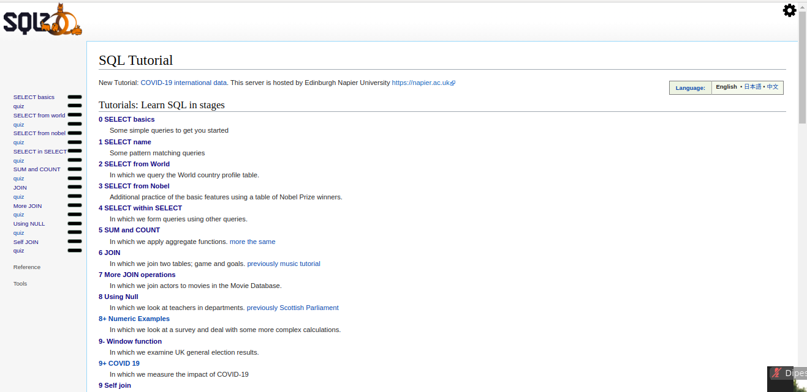

# SQLZoo Answers

> Working answers for the lessons featured on https://sqlzoo.net/wiki/SQL_Tutorial

Additional description about the project and its features.

## Built With

- SQLite

## Authors

👤 **Meltrust**

- Github: [@meltrust](https://github.com/meltrust)
- Linkedin: [meltrust](https://linkedin.com/meltrust)

## 🤝 Contributing

Contributions, issues and feature requests are welcome!

Feel free to check the [issues page](issues/).

## Show your support

Give a ⭐️ if you like this project!

## Acknowledgments

- Hat tip to anyone whose code was used
- Inspiration
- etc

## 📝 License

This project is [MIT](lic.url) licensed.
